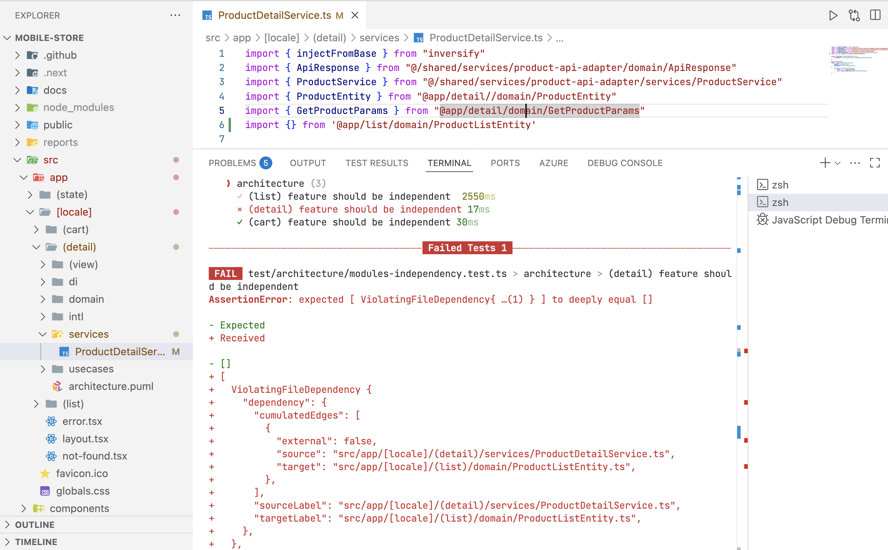
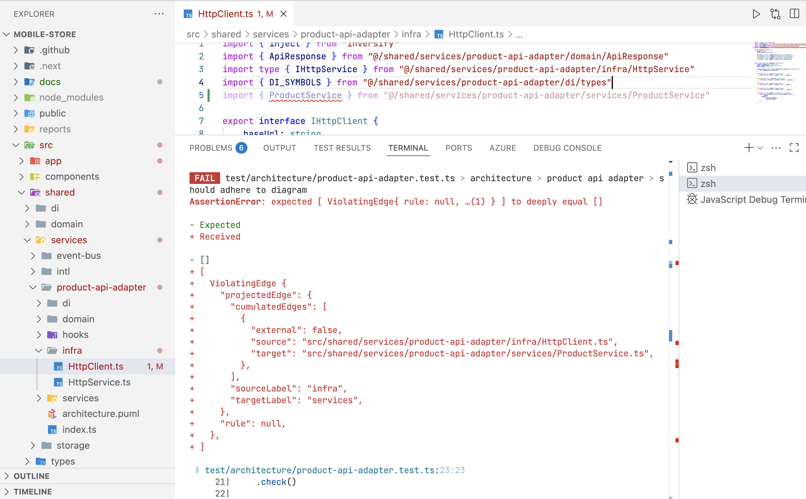
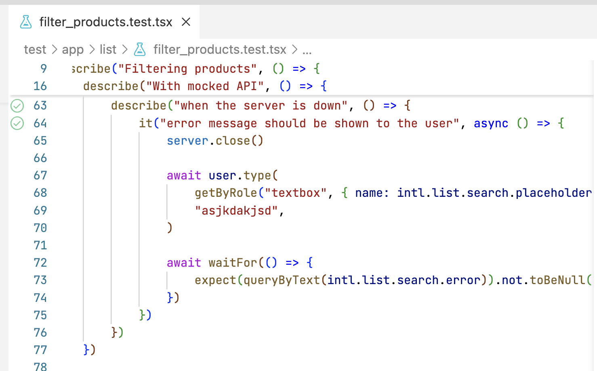
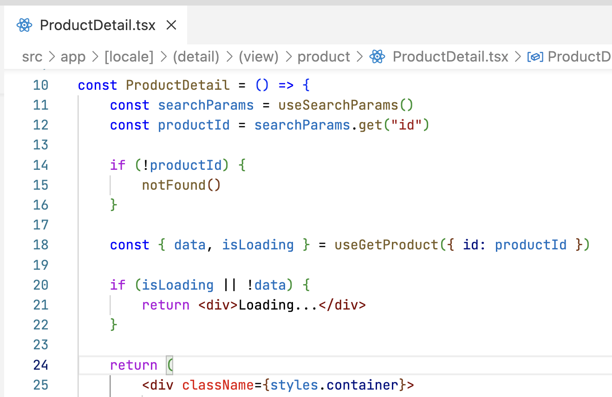
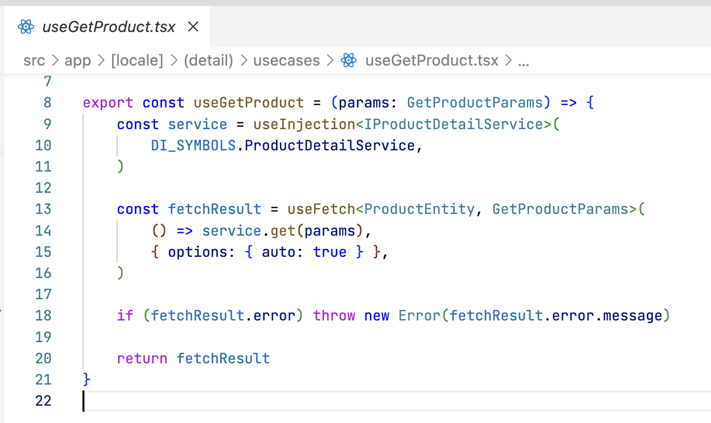
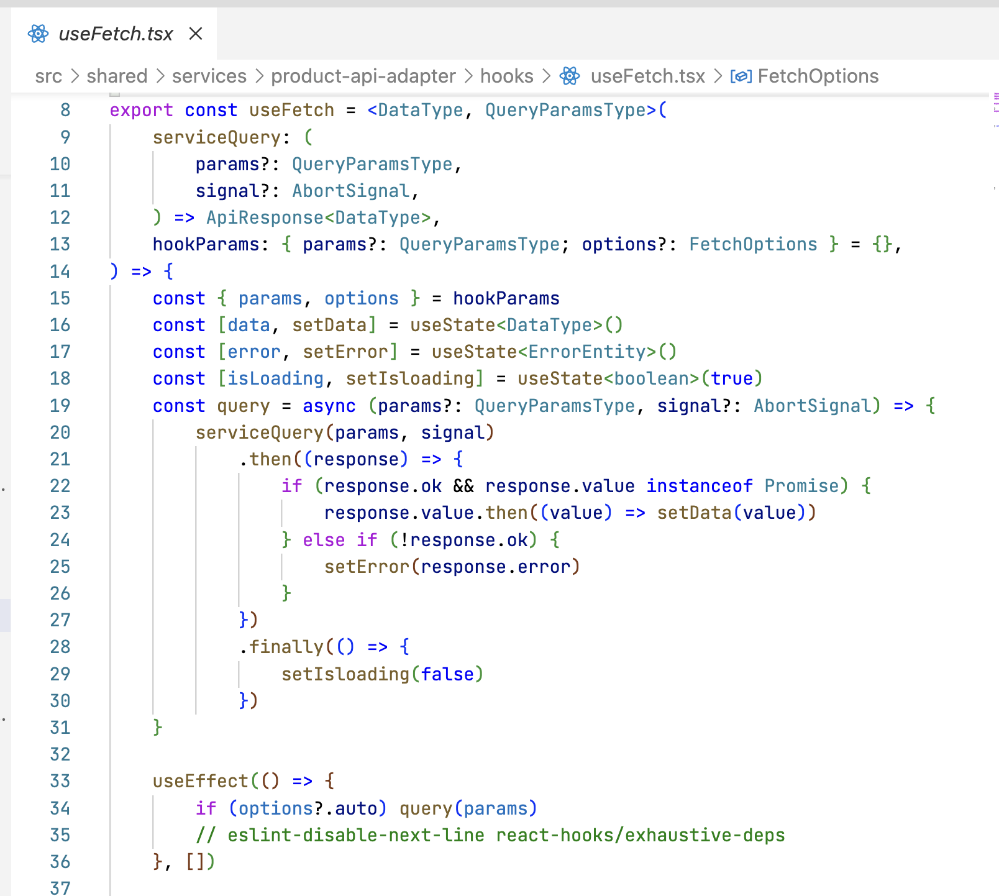
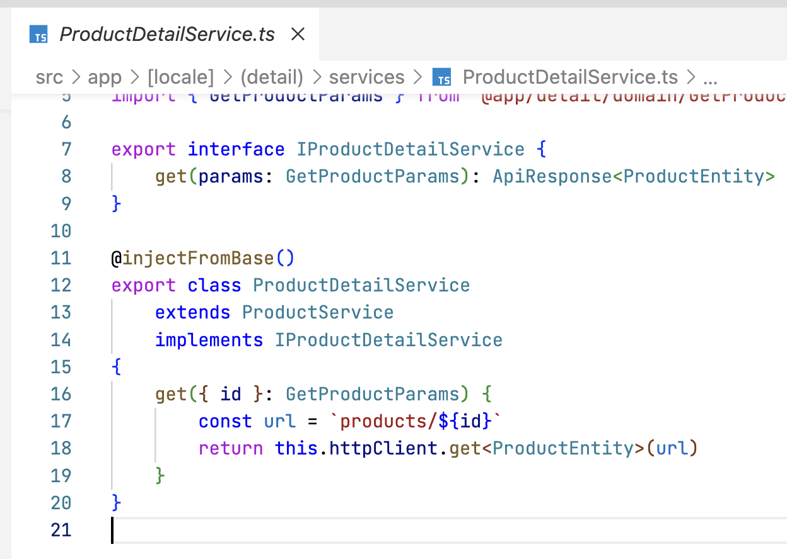
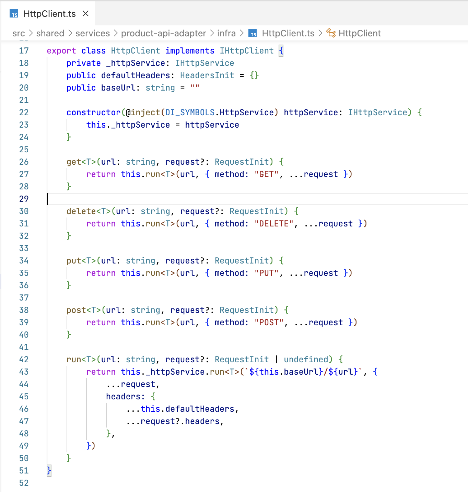

# Mobile store

## Guía de uso

### Instalación

```sh
npm ci
```

### Ejecutar en local

Necesitarás configurar las variables de entorno. Son del tipo:

```json
NEXT_PUBLIC_API_URL=https://your-api-url.com
NEXT_PUBLIC_API_KEY=your-api-key-here
NEXT_PUBLIC_SEARCH_LIMIT=20
```

Crea un archivo llamado .env.local en la carpeta root del proyecto con las mismas.

```sh
npm run dev
```

### Tests

```sh
npm run test
```

También puedes ejecutarlos en modo watch con la UI de vitest

```sh
npm run test:watch
```

### Formateo de archivos con prettier

```sh
npm run format:check
npm run format:fix
```

### Lintando archivos con eslint

```sh
npm run lint:check
npm run lint:fix
```

## Definición de rutas

- /en
  - /cart
  - /product?id=

- /es
  - /cart
  - /product?id=

## Funcionalidades a destacar

- Uso pipelines
- Separación ambientes desarrollo y producción.
- Localización con intl
  - Uso de módulos para mejorar escalabilidad horizontal
- Inyección de dependencias con inversify
  - Uso de módulos para mejorar escalabilidad horizontal
- Uso de estado con context y patrón reducer
- Llamadas a API con tokens de cancelación y debounce para optimizar datos compartidos y evitar sobrecargas en el servidor
- Lazy load para optimizar carga de imágenes
- Implementación de un event bus con RXJS para permittir la comunicación entre funcionalidades, evitando acoplamiento
- Uso de ErrorBoundary customizado para gestionar errores
- Deploy en ghpages
- Uso de nextjs y SSR

### Estrategia de testing

- Tests de architectura con ts-arch
  - Compruebo que las funcionalidades (list, cart, detail) son independientes entre sí. En caso de haber una referencia inválida, ésta será detectada en los tests como se muestra en la siguiente imagen.
    [modules-independency.test.ts](./test/architecture/modules-independency.test.ts)
    

  - Compruebo que cada funcionalidad o utilidad de la aplicación sigue una arquitectura correcta. Cada módulo independiente puede definir su arquitectura en un archivo .puml, donde se pueden definir las relaciones entre sus componentes. Si las relaciones son violadas, puedo detectarlo en los tests. El reporte será el de la imagen de abajo, ya que no puedo tener una referencia desde infra a services.
    El archivo de test:
    [product-api-adapter.test.ts](./test/architecture/product-api-adapter.test.ts)
    El archivo de arquitectura: [architecture.puml](./src/shared/services/product-api-adapter/architecture.puml)
    
    Cabe destacar que usar puml nos facilita también documentar, ya que hay utilidades para crear png a partir de estos archivos, como [https://plantuml.com/es/](https://plantuml.com/es/)

- Tests de accesibilidad con axe-core
- Tests muy reales y basados en escenarios con MSW para mockear respuestas del servidor
- Tests de tolerancia a fallos utilizando MSW para parar el servidor. Por ejemplo, en el siguiente test pruebo que cuando paro el servidor y hago un filtrado se muestre el error boundary.
  

## Podríamos seguir trabajando en ...

- Crear un logger y usarlo en HttpService cuando hay un error en el servidor. Así podríamos gestionarlos conectándonos a un servicio y permitir cambiarlo fácilmente
- Estilos
- Mayor abstracción de componentes
- Accesibilidad
- Error boundary más pequeños
- Suspense
- ViewTransitions
- Desacoplar carrito del estado global
- Mejor SSR (había utilizado NextJS de una forma muy básica en el pasado). Quizás podríamos renderizar en servidor algunas páginas si supiéramos los id que hay en base de datos (o los más llamados)
  ...

## Definición de arquitectura

Para definir la arquitectura me he basado en dos filosofías:

- Razón única de cambio: el objetivo a buscar es que cada archivo sólo tenga un motivo de cambio (Principio de Responsabilidad Única)
- Independencia modular: cada módulo/funcionalidad debe ser independiente. Esto hace muy fácil mantener los mismos, así como expandir el sistema y gestionar el proyecto por distintos equipos de desarrollo. Además, favorecerá futuras migraciones.

A raíz del primer punto (razón única de cambio) he organizado cada módulo de la aplicación usando una arquitectura similar a la arquitectura de cebolla. Los módulos suelen componerse de:

- view (opcional)
- usecases
- services
- infra
- domain
  Normalmente el flujo irá hacia desde usecases hasta infraestructura, iniciado por la vista. Todos conocen a dominio. Ver siguiente punto (depurando un caso de uso).
  Para favorecer la implementación de la misma, existen tests de arquitectura y se usa inyección de dependencias.

A raíz del segundo punto (independencia modular) he organizado las funcionalidades por directorios. Así, seguiría una arquitectura similar a vertical slice. Existen tests para comprobar que un módulo no llama a otro.
Además, en caso de que se necesiten comunicar, he añadido una implementación de event bus. Así, se podrá formalizar un contrato que deba de ser cumplido en caso de que un módulo quiera ser reemplazado.

## Depurando un caso de uso: Obtener un producto

1. (app/detail/view) El componente inicia el use case
   

1. (app/detail/usecase) El use case: - Carga el servicio a utilizar desde el contenedor de inyección de dependencias - Usa un hook para llamar a este servicio, que gestiona los errores, la carga de datos y el estado ocupado.
   

1. (shared/services/product-api-adapter/hooks) El hook useFetch llama al servicio y gestiona error, datos y loading
   

1. (app/detail/services/ProductDetailService) El servicio que había sido llamado por useFetch es finalmente llamado. Este especifica como conectarse a la API (método, URI, parámetros...). Hereda de ProductService, que añadirá la cabecera x-api-key para autenticarse. Así, si cambiamos el método de autenticación, sólo haremos un cambio en un archivo.
   

1. (shared/services/product-api-adapter/services/HttpClient) El servicio HttpClient delega a un servicio de infraestructura (HttpService) la ejecución real de la petición.
   

1. (shared/services/product-api-adapter/infra/HttpService) El servicio de infraestructura HttpService acaba haciendo la petición gracias a fetch. Gestiona los errores y el resultado. Si quisieramos usar axios o otro método sobre fetch, sólo debemos de cambiarlo en un sitio.
   
